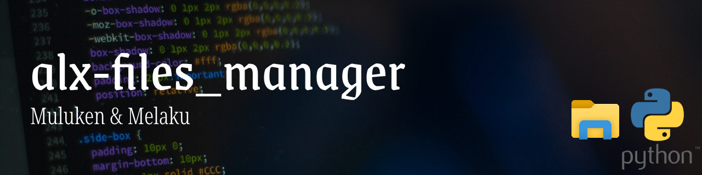

# Files Manager

## Overview
This project is a culmination of key back-end concepts including authentication, Node.js, MongoDB, Redis, pagination, and background processing. The primary objective is to create a simple platform for uploading and viewing files with the following features:

## Features

The project incorporates the following features:

1. **User Authentication via Token:** Users can authenticate themselves using a token-based system, ensuring secure access to the platform.

2. **List All Files:** The platform allows users to view a comprehensive list of all uploaded files.

3. **Upload a New File:** Users can seamlessly upload new files to the platform, contributing to the repository of available resources.

4. **Change Permission of a File:** File permissions are dynamic, allowing users to modify access levels as needed.

5. **View a File:** Users can preview the content of a file directly within the platform.

6. **Generate Thumbnails for Images:** For image files, the system automatically generates thumbnails, enhancing the user experience.

## Table of Contents
- [Files Manager](#files-manager)
  - [Overview](#overview)
  - [Features](#features)
  - [Table of Contents](#table-of-contents)
  - [System Requirements](#system-requirements)
  - [Dependencies](#dependencies)
    - [APIs](#apis)
    - [Environment Variables](#environment-variables)
  - [Installation](#installation)
  - [Usage](#usage)
  - [Tests](#tests)

## System Requirements
- Node.js: 16.x
- npm: 8.x
- yarn: 1.x

## Dependencies
- bull: ^3.16.0
- chai-http: ^4.3.0
- dotenv: ^16.0.1
- express: ^4.17.1
- googleapis: ^101.0.0
- image-thumbnail: ^1.0.10
- mime-message: ^0.1.3
- mime-types: ^2.1.27
- mongodb: ^3.5.9
- redis: ^2.8.0
- sha1: ^1.1.1
- uuid: ^8.2.0

### APIs

+ A Google API should be created with at least an email sending scope and a valid URL (e.g.; `http://localhost:5000/`) should be one of the redirect URIs. The `credentials.json` file should be stored in the root directory of this project.

### Environment Variables

The required environment variables should be stored in a file named `.env` and each line should have the format `Name=Value`. The table below lists the environment variables that will be used by this server:

| Name | Required | Description |
|:-|:-|:-|
| GOOGLE_MAIL_SENDER | Yes | The email address of the account responsible for sending emails to users. |
| PORT | No (Default: `5000`)| The port the server should listen at. |
| DB_HOST | No (Default: `localhost`)| The database host. |
| DB_PORT | No (Default: `27017`)| The database port. |
| DB_DATABASE | No (Default: `files_manager`)| The database name. |
| FOLDER_PATH | No (Default: `/tmp/files_manager` (Linux, Mac OS X) & `%TEMP%/files_manager` (Windows)) | The local folder where files are saved. |

## Installation

+ Clone this repository and switch to the cloned repository's directory.
+ Install the packages using `yarn install` or `npm install`.

## Usage

Start the Redis and MongoDB services on your system and run `yarn start-server` or `npm run start-server`.

## Tests

+ Create a separate `.env` file for the tests named `.env.test` and store the value of the environment variables for the testing event in it.
+ Run `yarn test` or `npm run test` to execute the E2E tests.
